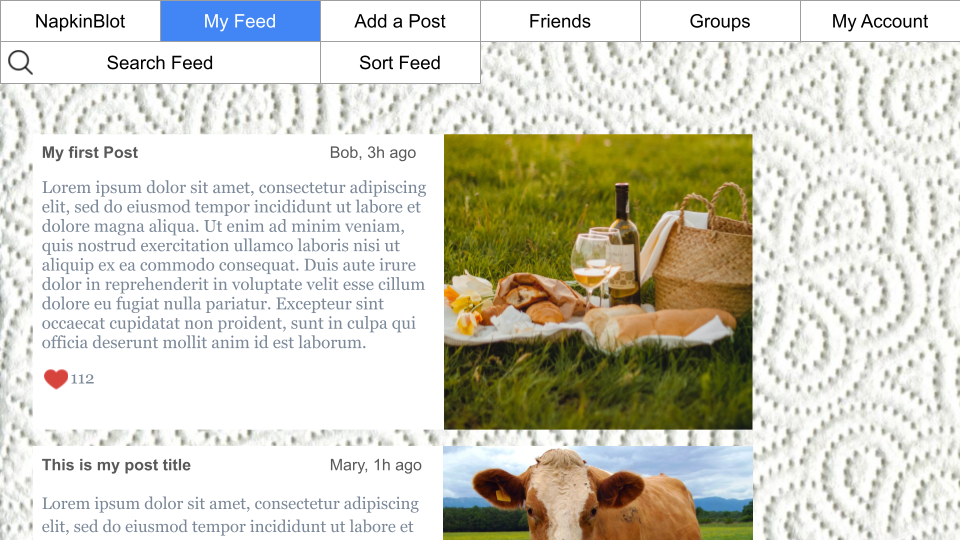

# Napkin

## Directory Structure

- **website/** _(For all website code.)_
- website/index.html
- website/style.css
- website/script.js
- **website/assets/** _(For all frontend assets.)_

- **server/** _(For all server code.)_

- **database/** _(For database code.)_

## License
