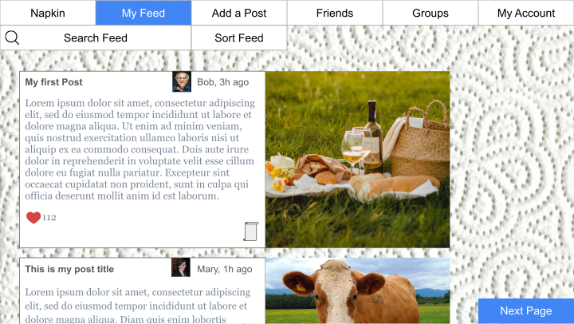

# Napkin

## Directory Structure

- **database/** _(For SQL databases and code.)_

- **reference/** _(For all project reference design materials.)_

- **server/** _(For all server-side code for Node.)_

- **website/** _(For all website code.)_
  - **website/assets/** _(For all frontend assets.)_

## License
